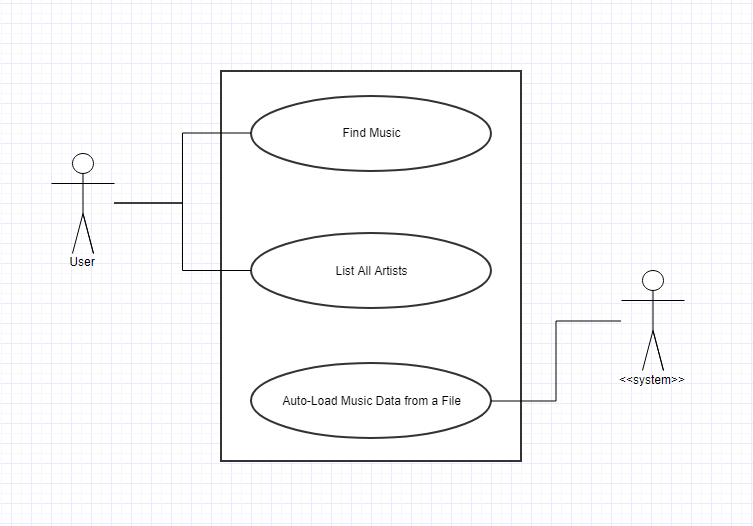

# Use Cases

## Use Cases

**Title:** Find Music
**Primary Actor:** User
**Success Scenario:** User selects a type of search - by artist, song title, or genre. User types in search keywords. The system accepts the keywords and begins a search based on the search criteria. System either finds a match or finds nothing - and returns the data to the user or prompts the user for another selection.

**Title:** List All Artists / Songs / Genres
**Primary Actor:** User
**Success Scenario:** User selects an option to list all the artist data contained in the system. The system retrieves all the data for the artists and returns it to the user in the form of an ordered list.

**Title:** Auto-Load Music Data from a File
**Primary Actor:** System
**Success Scenario:** The system will load a file from a specified path that contains information about music. Upon loading the data, the system will parse the data content into rows for each line of data in the file. The system will take each row of data and analyze it - dividing the data in each row into parts for the information of a song title, an artist name, and the genre of the song. The system will take the data pieces and build corresponding objects for each data type. While building the objects, the system will implement relationships between the data pieces by creating a Song object that accepts an Artist and Genre object for the artist and genre data entries of the Song object. The system will save each piece of data to a master list for the Songs, Artists, and Genres. The system will repeat this process for each row found within the data file.

